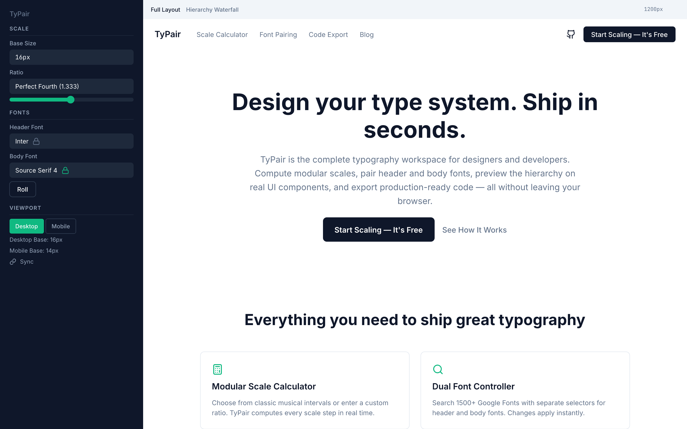
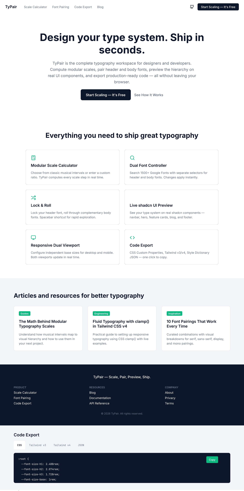
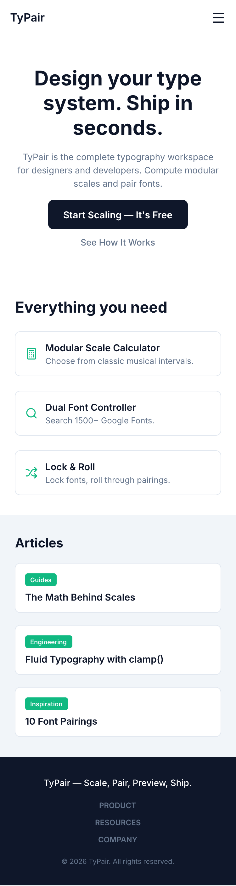
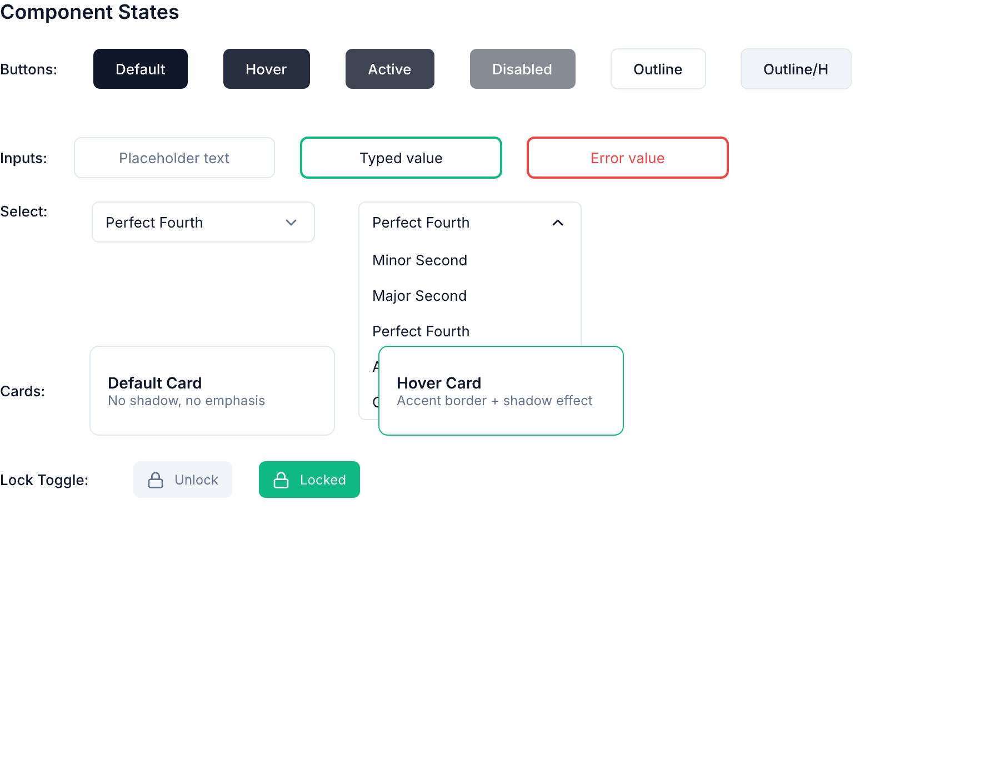
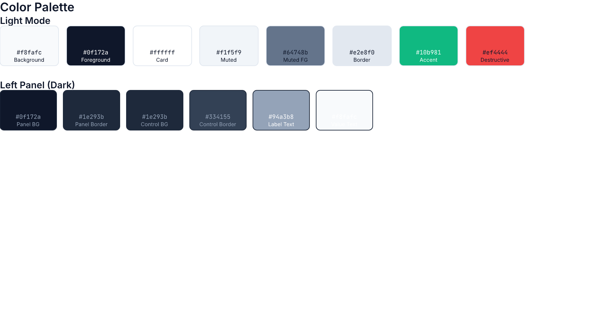

# Design System: TyPair

## 1. Three Design Direction Options

| Aspect | Option A: Developer's Workbench | Option B: Designer's Studio | Option C: Hybrid Canvas |
|--------|-------------------------------|-----------------------------|------------------------|
| **Visual Style** | Brutalist-clean — raw borders, visible grid lines, monospaced labels, schematic. Inspired by shadcn/ui docs and terminal UIs. | Minimalist polished — subtle shadows, rounded corners, generous whitespace, smooth transitions via framer-motion. Inspired by Coolors and Figma. | Split-screen duality — left panel uses schematic/dev aesthetic, right preview panel uses polished designer aesthetic. Controls recede, content shines. |
| **Primary Color** | Zinc-900 (#18181b) background, Zinc-50 (#fafafa) foreground | Slate-950 (#020617) dark, Slate-50 (#f8fafc) light | Slate-900 (#0f172a) dark, Slate-50 (#f8fafc) light |
| **Accent Color** | Emerald-500 (#10b981) — technical, trustworthy | Blue-500 (#3b82f6) — creative, vibrant | Emerald-500 (#10b981) — balanced, professional |
| **Interface Font** | JetBrains Mono / Geist Mono — coding tool feel | Inter — neutral workhorse | Geist — modern, neutral, works for both camps |
| **Complexity** | Medium — feature-rich via tabs and collapsible sections | Low-Medium — focused, streamlined, progressive disclosure | Medium-High — all features with smart defaults |
| **Best For** | Frontend engineers, design system maintainers | Product designers, UI/UX professionals, freelancers | Both audiences — adaptable by default |
| **Pros** | Trustworthy UI, fast, appeals to developers, pairs with code export | Beautiful, inviting, lower learning curve, strong differentiation | Broadest appeal, single codebase, can A/B test onboarding |
| **Cons** | Too austere for pure designers, less inspiring for marketing | Less efficient for power users, animation overhead | Harder to maintain dual aesthetic, risk of feeling designed by committee |

---

## 2. Selected Option

**Chosen Direction**: Option C — Hybrid Canvas

**Rationale**:
- TyPair's target audience spans both designers (Taylor) and developers (Alex). A pure dev aesthetic alienates Taylor; a pure design aesthetic alienates Alex. The split-screen workspace maps naturally to a dual-aesthetic approach — left panel is the engineer's control surface (schematic, precise, dense), right panel is the designer's canvas (polished, spacious, beautiful).
- The researcher recommended Option C and the user confirmed agreement.
- The left panel's schematic aesthetic signals "tool" and "precision" — appropriate for scale math and code export. The right panel's polished aesthetic signals "preview" and "result" — appropriate for evaluating typography on real UI.
- Single codebase with CSS variable-driven theming means both aesthetics share the same component primitives, just with different visual tokens.

---

## 3. Color Palette

### Light Mode

| Name | Hex | Usage |
|------|-----|-------|
| Background | #f8fafc (Slate-50) | Page background |
| Foreground | #0f172a (Slate-900) | Primary text |
| Card | #ffffff | Card/surface backgrounds |
| Card Foreground | #0f172a | Text on cards |
| Muted | #f1f5f9 (Slate-100) | Muted backgrounds |
| Muted Foreground | #64748b (Slate-500) | Muted text |
| Border | #e2e8f0 (Slate-200) | Borders and dividers |
| Input | #e2e8f0 (Slate-200) | Input borders |
| Primary | #0f172a (Slate-900) | Primary buttons, active states |
| Primary Foreground | #f8fafc (Slate-50) | Text on primary |
| Accent | #10b981 (Emerald-500) | Focus rings, active sliders, selected font chips, export buttons, links |
| Accent Foreground | #f8fafc | Text on accent |
| Destructive | #ef4444 (Red-500) | Reset, destructive actions |
| Ring | #10b981 (Emerald-500) | Focus ring outlines |

### Dark Mode

| Name | Hex | Usage |
|------|-----|-------|
| Background | #0f172a (Slate-900) | Page background |
| Foreground | #f8fafc (Slate-50) | Primary text |
| Card | #1e293b (Slate-800) | Card/surface backgrounds |
| Card Foreground | #f8fafc | Text on cards |
| Muted | #1e293b (Slate-800) | Muted backgrounds |
| Muted Foreground | #94a3b8 (Slate-400) | Muted text |
| Border | #334155 (Slate-700) | Borders and dividers |
| Input | #334155 (Slate-700) | Input borders |
| Primary | #f8fafc (Slate-50) | Primary buttons |
| Primary Foreground | #0f172a (Slate-900) | Text on primary |
| Accent | #34d399 (Emerald-400) | Focus rings, active sliders, selected font chips |
| Accent Foreground | #0f172a | Text on accent |
| Destructive | #f87171 (Red-400) | Reset, destructive actions |
| Ring | #34d399 (Emerald-400) | Focus ring outlines |

### Left Panel (Schematic/Dark)

| Name | Hex | Usage |
|------|-----|-------|
| Panel Background | #0f172a (Slate-900) | Left panel surface |
| Panel Border | #1e293b (Slate-800) | Panel edge |
| Control Background | #1e293b | Input/select backgrounds |
| Control Border | #334155 | Input borders |
| Label Text | #94a3b8 (Slate-400) | Field labels |
| Value Text | #f8fafc (Slate-50) | Values, active controls |

### Right Panel (Preview/Light)

| Name | Hex | Usage |
|------|-----|-------|
| Canvas Background | #ffffff | Preview surface |
| Canvas Text | #0f172a | Preview text content |
| Component Border | #e2e8f0 | shadcn component borders |

---

## 4. Typography

### Interface (TyPair UI Shell)

| Element | Font | Weight | Size | Line Height |
|---------|------|--------|------|-------------|
| Header / Nav | Geist (or Inter) | 600 | 14px | 20px |
| Section Title | Geist | 500 | 13px | 18px |
| Control Label | Geist | 500 | 12px | 16px |
| Value / Input Text | Geist | 400 | 13px | 18px |
| Code / Token Display | JetBrains Mono | 400 | 12px | 18px |
| Tooltip | Geist | 400 | 11px | 16px |

### Preview (User-Selected Type Scale)

The right panel renders using the user's configured header and body fonts at computed scale steps. The interface shell must remain visually neutral (Geist/Inter) to eliminate competition with the previewed fonts.

---

## 5. Component Specifications

### Button (Primary)

| State | Background | Text | Border | Shadow |
|-------|-----------|------|--------|--------|
| Default | `bg-primary` | `text-primary-foreground` | none | none |
| Hover | opacity 0.9 | same | none | `shadow-sm` |
| Active | opacity 0.8 | same | none | `shadow-inner` |
| Disabled | opacity 0.5 | opacity 0.5 | none | none |

- Padding: 8px 16px
- Border radius: 6px
- Font: Geist 500, 13px
- Transition: 150ms ease-out on background/opacity

### Button (Outline)

| State | Background | Text | Border |
|-------|-----------|------|--------|
| Default | transparent | `text-foreground` | `border-input` 1px |
| Hover | `bg-muted` | same | same |
| Active | `bg-muted` opacity 0.8 | same | same |
| Disabled | transparent | opacity 0.5 | opacity 0.3 |

- Same sizing as primary button

### Text Input / Select

| State | Background | Border | Text |
|-------|-----------|--------|------|
| Default | `bg-control` (left) / `bg-input` | `border-control` | `text-value` |
| Focused | same | `ring-2 ring-accent` | same |
| Error | same | `ring-2 ring-destructive` | same |
| Disabled | opacity 0.5 | opacity 0.3 | opacity 0.5 |
| Placeholder | — | — | `text-muted-foreground` |

- Padding: 8px 12px
- Border radius: 6px
- Font: Geist 400, 13px
- Transition: 150ms ease-out on border/ring

### Slider (shadcn Slider)

| Element | Track | Range | Thumb |
|---------|-------|-------|-------|
| Default | `bg-control` (h-2, rounded-full) | `bg-accent` | 16px circle, `bg-accent`, `ring-2 ring-accent` |
| Hover | — | — | same + shadow |
| Focus | — | — | same + `ring-4 ring-accent/30` |

### Tabs (shadcn Tabs)

| Element | Active | Inactive | Hover |
|---------|--------|----------|-------|
| Tab Trigger | `text-foreground` + bottom border `border-accent` 2px | `text-muted-foreground` | `text-foreground` |
| Tab Content | full opacity | — | — |

- Font: Geist 500, 12px
- Padding: 8px 16px
- Transition: 150ms ease-out on color

### Card (shadcn Card)

| State | Background | Border | Shadow |
|-------|-----------|--------|--------|
| Default | `bg-card` | `border-border` | none |
| Hover | same | `border-accent/50` | `shadow-md` |

- Border radius: 8px
- Padding: 24px
- Transition: 200ms ease-out on border/shadow

### Popover + Command (Font Search)

- Uses shadcn Popover + Command pattern
- Popover: white/card background, 8px radius, shadow-lg, z-50
- Command input: search icon + text input at top
- Command items: 32px height, hover state `bg-muted`, active state `bg-accent/10 text-accent`
- Selected item: `bg-accent/10` + checkmark icon
- Empty state: centered "No fonts found" text
- Font preview: each item shows font name in its own typeface

### Lock Toggle

| State | Icon | Color |
|-------|------|-------|
| Unlocked | `unlock` (Lucide) | `text-muted-foreground` |
| Locked | `lock` (Lucide) | `text-accent` fill |
| Hover | — | `text-foreground` |

- Icon size: 16px
- Click area: 32x32px minimum
- Transition: 150ms ease-out on color, icon swap

---

## 6. Spacing System

Base unit: 4px

| Token | Value | Usage |
|-------|-------|-------|
| `--space-1` | 4px | Tight gaps, icon padding |
| `--space-2` | 8px | Button padding, small gaps |
| `--space-3` | 12px | Input padding, control groups |
| `--space-4` | 16px | Card padding, section gap |
| `--space-5` | 20px | Panel padding |
| `--space-6` | 24px | Large cards, modal padding |
| `--space-8` | 32px | Section margins |
| `--space-10` | 40px | Page section gaps |
| `--space-12` | 48px | Hero section padding |
| `--space-16` | 64px | Page margins |

### Layout

| Element | Padding | Gap |
|---------|---------|-----|
| Left control panel | 20px | 16px between sections |
| Right preview canvas | 0 (full bleed) | — |
| Section within panel | 0 | 12px between header + content |
| Control row | 0 | 8px between label + input |
| Nav bar | 12px 20px | 24px between nav items |
| Card grid | — | 20px gap |

---

## 7. Responsive Breakpoints

| Breakpoint | Width | Layout Adjustments |
|------------|-------|-------------------|
| Mobile | < 768px | Stack panels vertically: controls on top, preview below. Condensed controls (collapsible sections). |
| Tablet | 768px – 1024px | Side-by-side panels with narrower left panel (240px). Compact controls. |
| Desktop | 1024px – 1440px | Full split-screen: left panel 300px, right canvas fills rest. All controls visible. |
| Large Desktop | > 1440px | Same as desktop with wider canvas. Extra whitespace. |

### Preview Canvas Simulated Breakpoints

| Simulated Device | Width |
|-----------------|-------|
| Mobile | 375px |
| Tablet | 768px |
| Desktop | 1200px |
| Fluid | 100% of available canvas width |

---

## 8. Animation Specifications

### Layout Transitions

| Trigger | Property | Duration | Easing | Notes |
|---------|----------|----------|--------|-------|
| Font change | `font-family` on preview text | 200ms | ease-out | No animation on font-family itself — layout shift via framer-motion AnimatePresence |
| Scale change | text size, spacing | 200ms | ease-out | Smooth all layout properties |
| Viewport switch | preview container width | 300ms | ease-in-out | Resize animation with spring physics |
| Panel toggle | panel width | 250ms | ease-out | Collapsible sections in left panel |

### Micro-interactions

| Element | Trigger | Animation | Duration |
|---------|---------|-----------|----------|
| Lock icon | click | icon swap (Lucide unlock→lock) | 100ms |
| Button | hover | background darken | 150ms |
| Button | click | scale(0.97) then scale(1) | 100ms |
| Card | hover | border color + shadow | 200ms |
| Select dropdown | open | fade + scaleY from top | 150ms |
| Copy toast | appear | slide up + fade | 250ms |
| Toast dismiss | auto | slide down + fade | 200ms |
| Dark/Light mode | toggle | CSS transition on background/color | 300ms |

### Page/Workspace Transitions

| Transition | Animation |
|------------|-----------|
| Initial load | Fade in workspace panels (100ms stagger: left panel first, right panel 50ms later) |
| Export panel tab switch | Immediate content swap (no animation — data integrity) |
| Lock & Roll font switch | AnimatePresence on font name text: old font fades out 100ms, new fades in 100ms |

### Timing Function Reference

- Ease-out: `cubic-bezier(0.16, 1, 0.3, 1)` — for most UI transitions
- Ease-in-out: `cubic-bezier(0.65, 0, 0.35, 1)` — for viewport resize
- Spring: `{ type: "spring", stiffness: 300, damping: 30 }` — framer-motion spring for viewport switch

---

## 9. Visual Style Rules

### Left Panel (Control Surface)
- Background: Slate-900 (dark) — matches terminal/IDE aesthetic
- All controls use monospaced or semi-monospaced font labels
- Section dividers: 1px border-top Slate-800 with uppercase section label in Slate-500
- Number inputs show computed values with monospaced digits
- Selected/chosen values highlighted in accent color (Emerald)
- Scrollbar: thin, dark theme

### Right Panel (Preview Canvas)
- Background: White (light mode) — clean, paper-like canvas
- Uses shadcn component class names for consistency with output code
- Viewport width indicator in top-right corner
- Toggle buttons (Full Layout / Waterfall) as small pill buttons in top toolbar
- Content reflects the user's custom preview text or default lorem ipsum

### Typography Scale Display (Hierarchy Waterfall)
- Each step rendered as a horizontal row with:
  - Label column (xs, sm, base, lg, xl, 2xl, etc.) — monospaced, 11px
  - Value column (px / rem) — monospaced, 11px
  - Sample text column — rendered in the active font at computed size
- Alternating row backgrounds for readability
- WCAG contrast badge (AA / AAA / Fail) as small colored pill in rightmost column

### Code Export Display
- Code block background: Slate-900 (matches VS Code dark theme)
- Syntax highlighting: minimal, monochrome with accent for values
- Tab bar: format names (CSS, Tailwind v3, Tailwind v4, JSON) as small tabs
- Copy button: top-right corner of code block, outline style

---

## 10. Icons

All icons from **Lucide React** library:

| Icon | Usage |
|------|-------|
| `Lock`, `Unlock` | Font lock toggle |
| `Shuffle` | Roll button |
| `Copy` | Copy to clipboard |
| `Check` | Copied confirmation |
| `Sun`, `Moon` | Dark/light mode toggle |
| `Monitor` | Desktop viewport |
| `Smartphone` | Mobile viewport |
| `LayoutGrid` | Full layout view |
| `List` | Hierarchy waterfall view |
| `Search` | Font search input |
| `Maximize2` | Expand preview |
| `Link` | Share URL |
| `Settings2` | Scale configuration |
| `Type` | Font selection |
| `Code2` | Code export |
| `Download` | Download all |
| `X` | Close/clear |
| `ChevronDown` | Select dropdown |
| `GripHorizontal` | Drag handle (if collapsible sections) |

---

## Visual Mockups

### Workspace Layout

### shadcn UI Preview — Desktop

### shadcn UI Preview — Mobile

### Component States

### Color Palette

